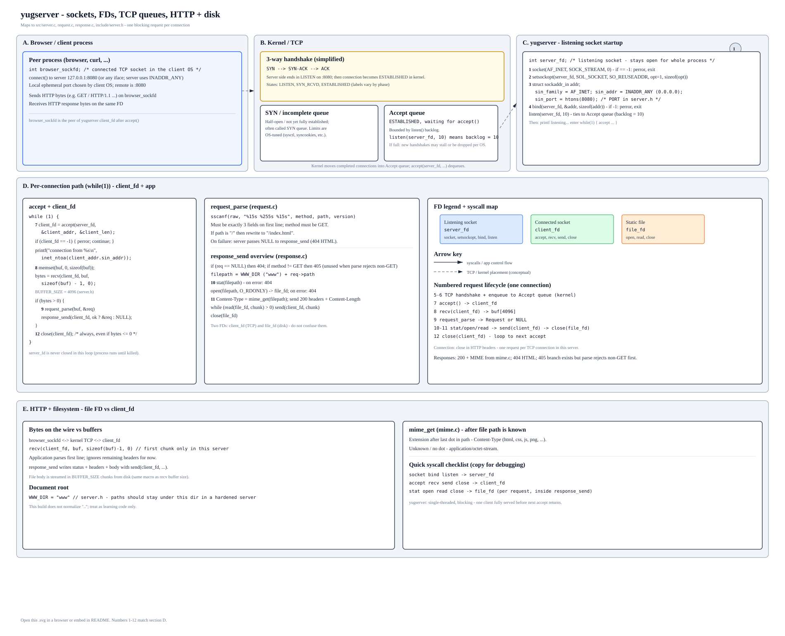
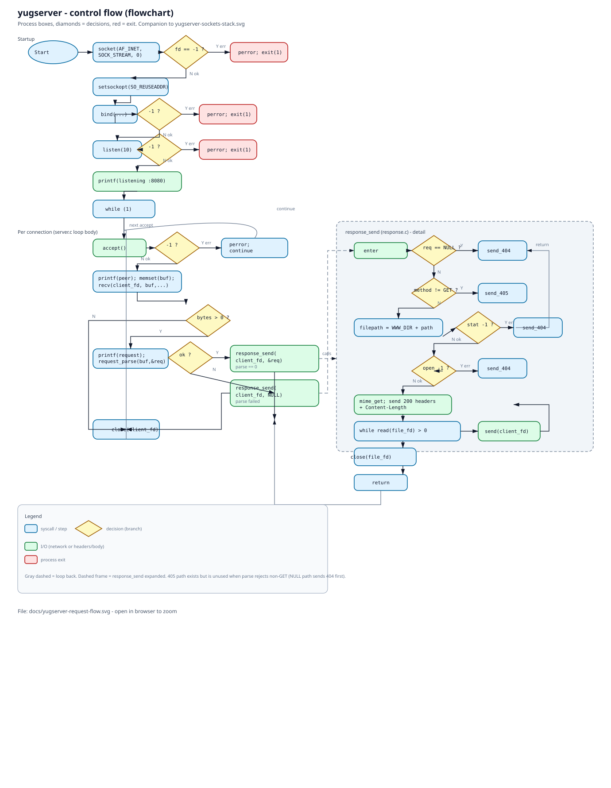
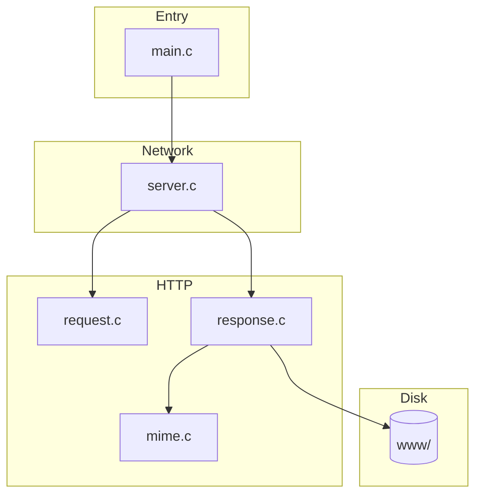
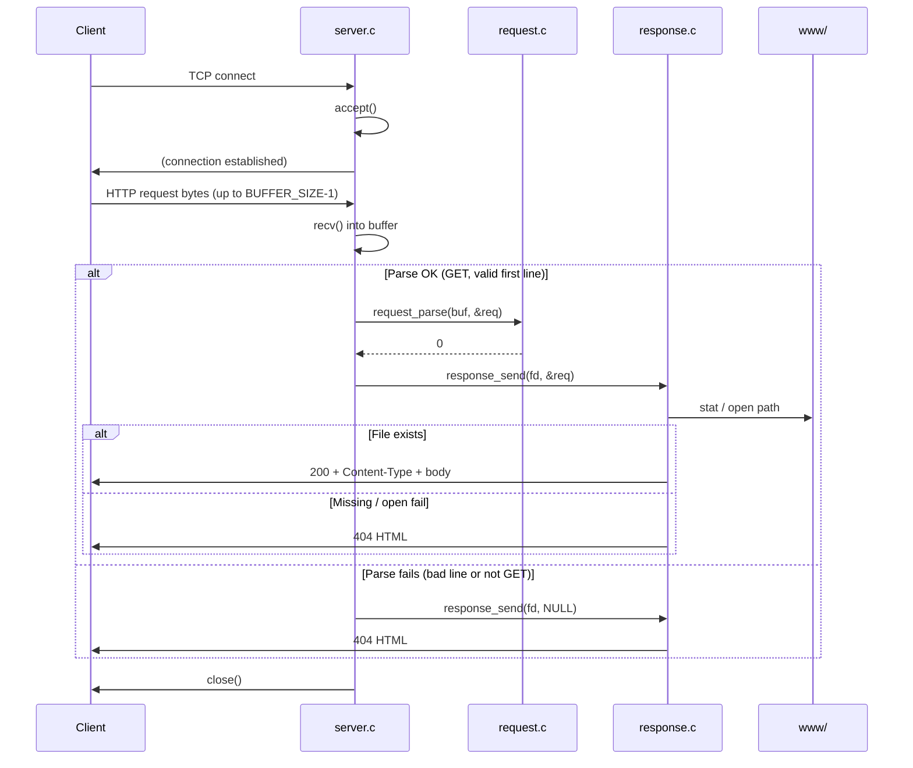
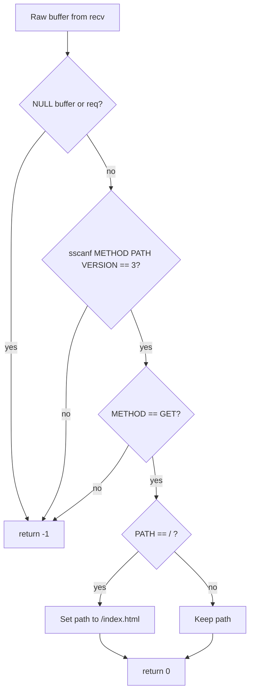
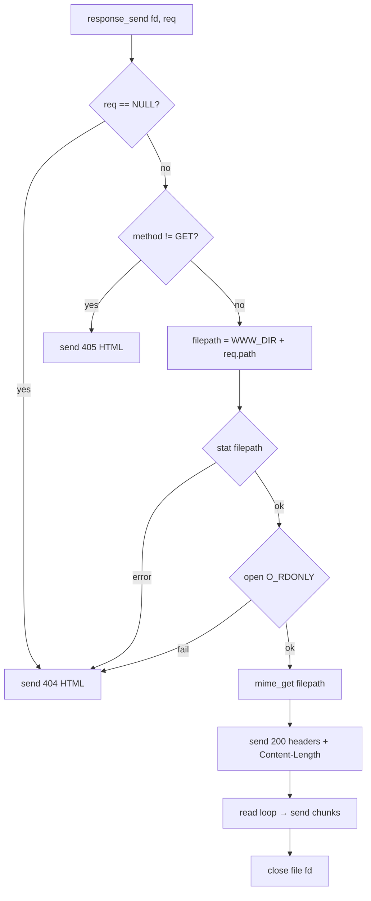

# yugserver

A minimal **HTTP/1.1 static file server** in C: one process, blocking I/O, `accept` → read one request → respond → close. Built for learning how sockets, HTTP framing, and static hosting fit together without frameworks.

### Architecture poster (browser → kernel → FDs)

Single SVG: TCP handshake, SYN vs accept queues, `listen(10)`, `server_fd` vs `client_fd` vs disk `file_fd`, and the `recv` / `send` / `stat` / `open` / `read` path. Open the file locally or view it on GitHub next to this README.



**Control-flow (flowchart):** startup syscalls, `accept` loop decisions, `request_parse`, and `response_send` branches (process boxes + diamonds).



---

## What it does

| Behavior | Detail |
|----------|--------|
| **Listen** | TCP on **port 8080** (`INADDR_ANY`), `SO_REUSEADDR` enabled |
| **Protocol** | Parses the **first line** of the request: `METHOD PATH VERSION` |
| **Supported method** | **GET** only; other methods fail **`request_parse`** → **`response_send(..., NULL)`** → **404** (the **405** branch in `response.c` is unused with today’s `server.c` loop) |
| **Root path** | Request path `/` is rewritten to **`/index.html`** before file lookup |
| **Document root** | Files are served from the **`www/`** directory (see `WWW_DIR` in `include/server.h`) |
| **Responses** | **200** + `Content-Type` from extension, **404** HTML page, **405** for non-GET when a valid `Request` is passed |
| **Connection** | **`Connection: close`** — one request per TCP connection |

---

## Quick start

```bash
cd httpserver
make
./build/yugserver
```

Open **http://localhost:8080/** (serves `www/index.html`). Sample pages live under `www/` (`index.html`, `about.html`).

**Clean build artifacts:**

```bash
make clean
```

**Toolchain:** `clang`, AddressSanitizer (`-fsanitize=address`), `-Wall -Wextra -pedantic`. Binary output: **`build/yugserver`**.

---

## Project layout

```
httpserver/
├── Makefile
├── README.md
├── include/
│   ├── server.h      # PORT, BUFFER_SIZE, WWW_DIR, server_start()
│   ├── request.h     # Request struct, request_parse()
│   ├── response.h    # response_send()
│   └── mime.h        # mime_get()
├── src/
│   ├── main.c        # entry → server_start()
│   ├── server.c      # socket, bind, listen, accept loop
│   ├── request.c     # sscanf first line, GET-only, / → /index.html
│   ├── response.c    # stat/open, headers, stream body
│   └── mime.c        # extension → Content-Type table
└── www/              # static files (document root)
    ├── index.html
    └── about.html
```

---

## Configuration (constants)

All in **`include/server.h`**:

| Symbol | Value | Role |
|--------|-------|------|
| `PORT` | `8080` | Listening port (`htons`) |
| `BUFFER_SIZE` | `4096` | Receive buffer and read chunk size for file body |
| `WWW_DIR` | `"www"` | Prepended to the request path for `stat` / `open` |

Change these and **`make`** again.

---

## Architecture (modules)



- **`server.c`**: Creates the listening socket, loops on `accept`, `recv`s into a buffer, dispatches to parse + respond.
- **`request.c`**: Extracts method/path/version from the raw buffer; normalizes `/` to `/index.html`; rejects non-GET at parse time.
- **`response.c`**: Builds `WWW_DIR + path`, checks existence with `stat`, sets `Content-Type` via `mime_get`, sends headers then streams the file.
- **`mime.c`**: Maps file extension (after the last `.`) to a MIME string; unknown → `application/octet-stream`.

---

## Per-connection flow (the main story)



**Note:** When `request_parse` fails, **`response_send(client_fd, NULL)`** runs, which sends the **404** page (not a 400 Bad Request). That is intentional in the current code path—handy to know when debugging with `curl`.

---

## Request parsing decision tree



Path length limits are implicit in `sscanf` field widths (`request.c`): method and version up to 15 chars, path up to 255 chars in the `Request` struct.

---

## Response decision tree



---

## MIME types (extension → `Content-Type`)

Handled in **`src/mime.c`**: `html`, `htm`, `css`, `js`, `json`, `png`, `jpg`, `jpeg`, `gif`, `ico`, `txt`, `pdf`. No extension or unknown extension → **`application/octet-stream`**.

---

## Limitations (by design)

- **Single-threaded:** One client is handled fully before the next `accept`; no `fork`, threads, or `poll`/`epoll`.
- **One read per connection:** Only the first `recv` is used; large requests or pipelining are not supported.
- **Minimal HTTP:** Headers beyond the first line are ignored; no `Host` validation, no TLS, no chunked encoding, no range requests.
- **Path safety:** Paths are not normalized (`..` is not rejected in code); for a real deployment you would canonicalize and jail paths under `www/`.

---

## Try it

```bash
./build/yugserver
```

In another terminal:

```bash
curl -i http://127.0.0.1:8080/
curl -i http://127.0.0.1:8080/about.html
curl -i http://127.0.0.1:8080/nope.html   # expect 404
curl -i -X POST http://127.0.0.1:8080/    # parse fails → 404 with current wiring
```

---

## See also (source entry points)

| File | Responsibility |
|------|----------------|
| `src/main.c` | Calls `server_start()` |
| `src/server.c` | Socket lifecycle + accept loop |
| `src/request.c` | First-line parse + GET + `/` rewrite |
| `src/response.c` | Status lines, headers, file streaming |
| `src/mime.c` | Extension-based `Content-Type` |

Skim the diagrams top-to-bottom: **modules** → **sequence** → **parse tree** → **response tree** — that order matches how control flows from `main` to the wire.
