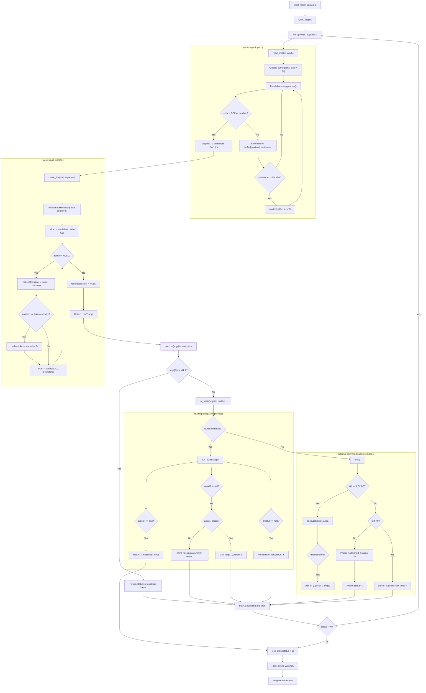

# yugshell

A minimal Unix-like shell written in C for learning process control, tokenization, and built-ins.

This README is based directly on the current `yugshell` source files in this repository.

## What yugshell does

- Shows the prompt `yugshell>: `
- Reads one command line from standard input
- Splits input by whitespace into `argv`-style tokens
- Runs built-ins (`cd`, `help`, `exit`) inside the shell process
- Runs all other commands as external programs using `fork()` + `execvp()`
- Waits for child process completion for external commands
- Repeats until `exit` returns status `0`

## High-level execution flow

The control loop in `main.c` is:

1. print prompt
2. `read_line()` from `input.c`
3. `parse_line()` from `parser.c`
4. `execute()` from `executor.c`
5. `free(line)` and `free(args)`
6. continue while status is non-zero

`main()` exits after loop termination and prints `exiting yugshell.`

## Detailed block diagram (in README)

This is the most detailed runtime diagram in text form so you can revise from README alone.



### Diagram notes (important)

- Built-ins execute in the shell process; this is why `cd` can change shell state.
- External commands execute in a child process created by `fork()`.
- `args` is NULL-terminated and used as `execvp` argv input.
- `parse_line()` tokens reference memory inside `line`; they are not deep-copied strings.
- Loop exit happens only when builtin `exit` returns `0`.

## Module responsibilities

- `main.c`
  - Owns the interactive loop (`loop()`).
  - Connects input, parser, and executor.
  - Controls shell lifecycle via return status.

- `input.c` / `input.h`
  - Implements `read_line()`.
  - Reads characters with `getchar()` until newline or EOF.
  - Uses dynamic buffer growth (`malloc` + `realloc`) starting from size `64`.
  - Returns a heap string that caller must free.

- `parser.c` / `parser.h`
  - Implements `parse_line(char *line)`.
  - Tokenizes with `strtok(line, " \t\r\n\a")`.
  - Grows token array dynamically from initial token capacity `8`.
  - Returns a NULL-terminated `char **` token list.
  - Tokens point into the original `line` buffer (no deep copy).

- `executor.c` / `executor.h`
  - Implements `execute(char **args)`.
  - Handles empty command (`args[0] == NULL`) by continuing loop.
  - Delegates built-ins to builtin dispatcher.
  - External command path:
    - `fork()`
    - child: `execvp(args[0], args)`
    - parent: `waitpid(pid, &status, 0)`
  - Returns `1` to continue loop, `0` to stop only via builtin `exit`.

- `builtins.c` / `builtins.h`
  - Builtin list: `cd`, `help`, `exit`.
  - `cd`: calls `chdir(args[1])`; prints error when missing arg.
  - `help`: prints usage summary.
  - `exit`: returns `0` to terminate shell loop.
  - `is_builtin()` checks command name membership.
  - `run_builtin()` dispatches to concrete builtin function.

- `Makefile`
  - Compiler: `clang`
  - Flags: `-Wall -Wextra -pedantic -g -fsanitize=address`
  - Output binary: `build/yugshell`
  - Object files go under `build/`

## Build and run

From `yugshell/`:

```bash
make
./build/yugshell
```

Clean build artifacts:

```bash
make clean
```

## Built-in command reference

- `cd [dir]`
  - Changes current working directory of shell process.
  - If no directory is provided, prints: `yugshell: cd: missing argument`

- `help`
  - Prints built-in command help.

- `exit`
  - Ends the shell session.

## External command behavior

For non-built-ins, yugshell relies on `execvp`, so:

- command lookup uses `PATH`
- arguments are passed as tokenized by whitespace
- process is blocking (shell waits until command completes)
- execution errors are shown via `perror("yugshell")`

## Current limitations (important for revision)

These are expected from the current code and not bugs in this README:

- No support for quoted strings (`"a b"` is split into two tokens)
- No pipelines (`|`), redirection (`>`, `<`), or background jobs (`&`)
- No command history or line editing
- `cd` does not default to `$HOME` when argument is omitted
- Parser uses `strtok`, so tokenization is simple whitespace splitting only

## Memory ownership model

- `read_line()` allocates `line` (heap) -> freed in `main.c`
- `parse_line()` allocates `args` array (heap) -> freed in `main.c`
- each `args[i]` points inside `line` buffer -> do not free individually

This ownership is why freeing order in `main.c` works safely.

## Quick revision checklist

When revising yugshell, verify these invariants:

1. Loop continues while `execute()` returns non-zero.
2. Built-ins run in parent shell process (especially `cd`).
3. External commands use `fork` + `execvp` + `waitpid`.
4. `args` remains NULL-terminated.
5. `line` and `args` are freed once per loop iteration.
6. `exit` path returns `0` from builtin to break loop.

## Suggested next evolution steps

- Add quoted-string aware tokenizer
- Add redirection (`>`, `<`, `>>`)
- Add single-pipe support
- Add `cd` with HOME fallback
- Add status code reporting (`$?`-like behavior)
